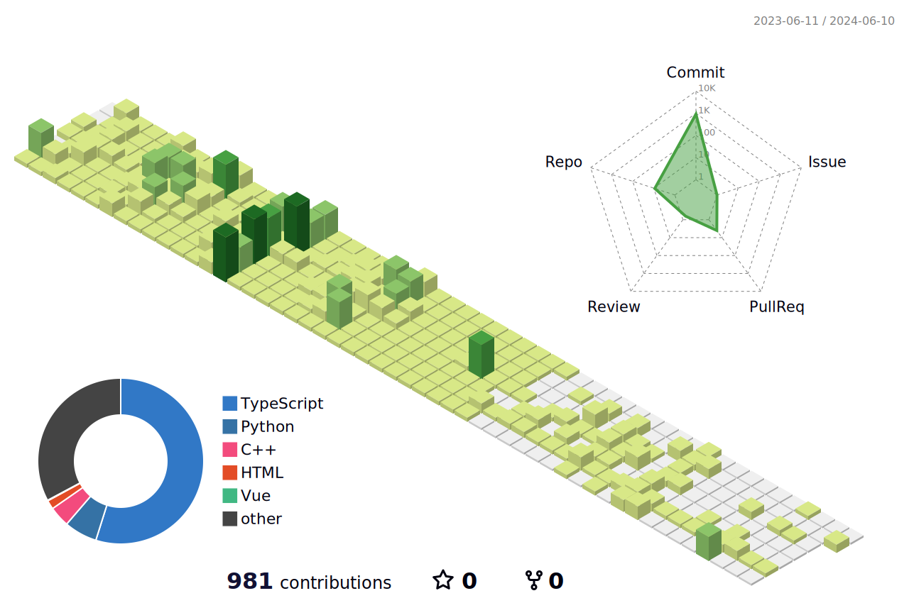

  <h2>About me 🐚</h2>
  

  Bachelor of Computer Science & Engineering, Incheon National Univ.
  
  Now I'm taking the Samsung Software Academy (SSAFY) 9th.  
  I'm growing up everyday  !
  <h4>Follow and Contact me </h4>
    

    
    
    

  

  
   

  <h2>Technical Skills</h2>
  

  
  <b>Back-end</b>

  

<b>Front-end</b>

<b>Others</b>

  

    
   
  
  <h2>My GitHub Analytics 🔍</h2>
  

  
  
  

 
                                                                          
  

